<div align="center">

# 🏛️ Richmond AI Agent
### *Intelligent Local Tech Community Assistant*

<p align="center">
  <em>A sophisticated AI agent demonstration using the <strong>Model Context Protocol (MCP)</strong> and <strong>Strands SDK</strong><br/>
  to deliver intelligent, context-aware responses about Richmond's vibrant tech ecosystem</em>
</p>

<p align="center">
  
  
  
  
</p>

<p align="center">
  <a href="#-quick-start">🚀 Quick Start</a> •
  <a href="#-architecture">🏗️ Architecture</a> •
  <a href="#-demo-scenario">📋 Demo</a> •
  <a href="#-deployment">🚀 Deploy</a> •
  <a href="#-usage">🖥️ Usage</a>
</p>

---

</div>

## 🚀 Quick Start

<table>
<tr>
<td width="50%">

### 🔧 Prerequisites
- 🐍 **Python 3.8+**
- ☁️ **AWS CLI** configured (optional)
- 🛠️ **SAM CLI** installed (optional)
- 🔑 **Anthropic API key**

</td>
<td width="50%">

### ⚡ 30-Second Setup
```bash
# Clone the repository
git clone <repository-url>
cd strands

# 🌟 ONE COMMAND INSTALL
make install

# That's it! Follow the prompts
```

</td>
</tr>
</table>

> **✨ NEW:** Just run `make install` and it does EVERYTHING for you - checks prerequisites, creates virtual environment, installs dependencies, validates setup, and runs tests!

### 🎯 Alternative Quick Start Options

<table>
<tr>
<td width="33%">

**Automated Script**
```bash
# For non-make systems
./quickstart-install.sh
```

</td>
<td width="33%">

**Traditional Setup**
```bash
# Manual setup
python setup.py
```

</td>
<td width="33%">

**Full Deploy**
```bash
# Setup + Deploy
make all
```

</td>
</tr>
</table>

## 🎉 What `make install` Does For You

The new `make install` command is a complete one-stop setup that:

1. **🔍 Checks Prerequisites** - Verifies Python 3.8+, AWS CLI, and SAM CLI
2. **🐍 Creates Virtual Environment** - Sets up an isolated Python environment
3. **📦 Installs All Dependencies** - Installs 30+ packages including Strands SDK
4. **🔐 Sets Up Environment** - Creates .env.template with all needed variables
5. **📊 Loads Sample Data** - Pre-loads Richmond tech community data
6. **✔️ Validates Setup** - Runs comprehensive validation checks
7. **🧪 Runs Tests** - Executes local tests to ensure everything works
8. **📝 Creates Quick Start Guide** - Generates a handy reference script

All in about **2-3 minutes**! No more manual setup steps or missing dependencies.

## 🏗️ Architecture

<div align="center">

### 🔄 End-to-End Agent Flow

```mermaid
graph LR
    A[👤 User Query] --> B[🌐 API Gateway]
    B --> C[⚡ Lambda Agent]
    C --> D[🧠 Claude 3.5]
    D --> E[🔧 MCP Tools]
    E --> F[🗄️ DynamoDB]
    F --> G[📊 Live Data]
    G --> H[💬 Response]
    
    style A fill:#e1f5fe
    style D fill:#f3e5f5
    style F fill:#fff3e0
    style H fill:#e8f5e8
```



</div>

<details>
<summary><strong>🔍 Detailed Flow Breakdown</strong></summary>

1. **👤 User** submits query via API or CLI
2. **🌐 API Gateway** routes to Lambda function
3. **⚡ Agent** (running in Lambda) processes the query
4. **🧠 Claude 3** reasons about the request via Anthropic API
5. **🔧 MCP Tools** dynamically query DynamoDB when needed
6. **🗄️ DynamoDB** returns live Richmond data
7. **💬 Agent** generates final response

</details>

### 🧩 Key Components

<div align="center">
<table>
<tr>
<td align="center" width="20%">
  
  <br/><strong>Agent</strong>
  <br/><code>agent.py</code>
  <br/><small>Strands-powered AI agent with MCP integration</small>
</td>
<td align="center" width="20%">
  
  <br/><strong>Lambda Handler</strong>
  <br/><code>lambda_handler.py</code>
  <br/><small>AWS Lambda API integration</small>
</td>
<td align="center" width="20%">
  
  <br/><strong>CLI</strong>
  <br/><code>cli.py</code>
  <br/><small>Command-line interface with Rich formatting</small>
</td>
<td align="center" width="20%">
  
  <br/><strong>Sample Data</strong>
  <br/><code>load_sample_data.py</code>
  <br/><small>Richmond tech community data</small>
</td>
<td align="center" width="20%">
  
  <br/><strong>Infrastructure</strong>
  <br/><code>template.yaml</code>
  <br/><small>SAM CloudFormation template</small>
</td>
</tr>
</table>
</div>

## 📋 Demo Scenario

<div align="center">

### 🎭 Live Demo Experience

<table>
<tr>
<td width="50%">

**💬 Sample Query**
```
"What's the next tech meetup happening in Richmond?"
```

**🔄 Expected Flow**
1. 🧠 Claude identifies need for external data
2. 🔧 Calls MCP tool `dynamodb_query` 
3. 📊 Receives meetup data from DynamoDB
4. 💬 Generates contextual response

</td>
<td width="50%">

**✨ Sample Response**
```json
{
  "response": "The next Richmond tech meetup is 
  RVA Cloud Wranglers on July 31st at 
  Common House. It's focused on AWS 
  best practices and starts at 6:30 PM.",
  
  "tools_used": ["dynamodb_query"],
  "confidence": 0.95
}
```

</td>
</tr>
</table>

</div>

---

<div align="center">
  
### 🎯 Try These Sample Queries

| Category | Query | Expected Tool |
|----------|-------|---------------|
| 📅 **Events** | *"What's happening this week?"* | `dynamodb_query` |
| 🏢 **Companies** | *"Tell me about Capital One's tech stack"* | `dynamodb_query` |
| 📍 **Venues** | *"Where can I host a developer event?"* | `dynamodb_query` |
| 🐍 **Languages** | *"Any Python meetups in Richmond?"* | `dynamodb_query` |
| 💼 **Jobs** | *"Who are the major tech employers?"* | `dynamodb_query` |

</div>

## 🔧 Installation & Setup

<div align="center">

### 🤖 Automated Setup (Recommended)

</div>

```bash
python setup.py
```

<div align="center">
<table>
<tr>
<td align="center" width="20%">
  
  <br/>**Prerequisites Check**
  <br/><small>Python, AWS CLI, SAM CLI</small>
</td>
<td align="center" width="20%">
  
  <br/>**Dependencies**
  <br/><small>Virtual environment setup</small>
</td>
<td align="center" width="20%">
  
  <br/>**Environment**
  <br/><small>API keys validation</small>
</td>
<td align="center" width="20%">
  
  <br/>**Configuration**
  <br/><small>Create .env template</small>
</td>
<td align="center" width="20%">
  
  <br/>**Testing**
  <br/><small>Optional local tests</small>
</td>
</tr>
</table>
</div>

### Manual Setup

1. **Install Dependencies**
   ```bash
   python -m venv .venv
   source .venv/bin/activate  # On Windows: .venv\Scripts\activate
   pip install -r requirements.txt
   ```

2. **Configure Environment**
   ```bash
   # Required
   export ANTHROPIC_API_KEY="your-anthropic-api-key"
   
   # Optional
   export AWS_PROFILE="your-aws-profile"
   export AWS_REGION="us-east-1" 
   ```

3. **Test Installation**
   ```bash
   python test_local.py
   ```

## 🚀 Deployment

### Deploy to AWS
```bash
# Quick deployment
./deploy.sh --stage prod --api-key $ANTHROPIC_API_KEY

# Custom deployment
./deploy.sh \
  --stage dev \
  --region us-west-2 \
  --stack-name my-richmond-agent \
  --api-key $ANTHROPIC_API_KEY \
  --model claude-3-5-sonnet-20241022
```

### Manual SAM Deployment
```bash
sam build
sam deploy --guided \
  --parameter-overrides \
    Stage=prod \
    AnthropicApiKey=$ANTHROPIC_API_KEY \
    ModelName=claude-3-5-sonnet-20241022
```

## 🖥️ Usage

### CLI Interface
```bash
# Interactive mode
python cli.py interactive

# Single query
python cli.py ask "What tech companies are in Richmond?"

# Query with context
python cli.py ask "Python meetups" --context '{"location": "downtown"}'

# Health check
python cli.py health

# Test with sample queries
python cli.py test

# Use deployed API
python cli.py --api-endpoint https://your-api.amazonaws.com/prod ask "Hello Richmond!"
```

### API Endpoints

#### POST `/ask` - Submit Query
```bash
curl -X POST https://your-api-gateway-url.amazonaws.com/prod/ask \
  -H "Content-Type: application/json" \
  -d '{
    "query": "What tech meetups are happening in Richmond this week?",
    "context": {}
  }'
```

#### GET `/health` - Health Check
```bash
curl https://your-api-gateway-url.amazonaws.com/prod/health
```

### Response Format
```json
{
  "response": "The next Richmond tech meetup is...",
  "tools_used": ["dynamodb_query"],
  "metadata": {
    "model": "claude-3-5-sonnet-20241022",
    "tokens_used": 150,
    "processing_time": 2.3
  },
  "request_id": "abc-123",
  "timestamp": "2024-01-15T10:30:00Z"
}
```

## 📊 Sample Data

<div align="center">
  <em>🏛️ Comprehensive Richmond tech ecosystem data, carefully curated for intelligent responses</em>
</div>

---

<div align="center">

### 🤝 Meetups & Events

<table>
<tr>
<td align="center" width="25%">
  
  <br/><strong>RVA Cloud Wranglers</strong>
  <br/><small>AWS & Cloud Computing</small>
  <br/><code>Monthly • 50+ members</code>
</td>
<td align="center" width="25%">
  
  <br/><strong>Richmond Python UG</strong>
  <br/><small>Python Development</small>
  <br/><code>Bi-weekly • 120+ members</code>
</td>
<td align="center" width="25%">
  
  <br/><strong>Data Science RVA</strong>
  <br/><small>Analytics & ML</small>
  <br/><code>Monthly • 200+ members</code>
</td>
<td align="center" width="25%">
  
  <br/><strong>RVA DevOps</strong>
  <br/><small>Infrastructure & Automation</small>
  <br/><code>Monthly • 85+ members</code>
</td>
</tr>
</table>

### 🏢 Companies

<table>
<tr>
<td align="center" width="25%">
  
  <br/><strong>Capital One</strong>
  <br/><small>Fintech & Digital Banking</small>
  <br/><code>5,000+ tech employees</code>
</td>
<td align="center" width="25%">
  
  <br/><strong>CarMax</strong>
  <br/><small>Automotive Retail Technology</small>
  <br/><code>800+ tech employees</code>
</td>
<td align="center" width="25%">
  
  <br/><strong>Flying Pig Labs</strong>
  <br/><small>Software Development</small>
  <br/><code>Boutique consultancy</code>
</td>
<td align="center" width="25%">
  
  <br/><strong>Hourly</strong>
  <br/><small>HR Technology Platform</small>
  <br/><code>Growing startup</code>
</td>
</tr>
</table>

### 📍 Venues

<table>
<tr>
<td align="center" width="25%">
  
  <br/><strong>Common House</strong>
  <br/><small>Co-working & Events</small>
  <br/><code>Downtown RVA</code>
</td>
<td align="center" width="25%">
  
  <br/><strong>Startup Virginia</strong>
  <br/><small>Startup Incubator</small>
  <br/><code>Innovation Hub</code>
</td>
<td align="center" width="25%">
  
  <br/><strong>VCU Innovation Gateway</strong>
  <br/><small>Research Hub</small>
  <br/><code>Academic Center</code>
</td>
<td align="center" width="25%">
  
  <br/><strong>The Frontier Project</strong>
  <br/><small>Creative Co-working</small>
  <br/><code>Arts District</code>
</td>
</tr>
</table>

</div>

## 🛠️ Development

### Local Testing
```bash
# Run all tests
python test_local.py

# Test specific components
python -m pytest tests/

# Check code quality
python -m black .
python -m isort .
python -m flake8
```

### Debug Mode
```bash
# CLI with debug logging
python cli.py --debug ask "Test query"

# Lambda local testing
sam local start-api
curl http://localhost:3000/ask -d '{"query": "test"}'
```

### Adding New Data
```python
# Add to load_sample_data.py
new_item = {
    'id': str(uuid.uuid4()),
    'type': 'meetup',  # or 'company', 'venue', 'event'
    'name': 'New Richmond Meetup',
    'description': '...',
    # ... other fields
}
```

## 🏗️ Architecture Details

### MCP Integration
- **Protocol**: Model Context Protocol for tool discovery
- **Server**: DynamoDB MCP Server (`awslabs.aws-dynamodb-mcp-server`)
- **Tools**: `get_item`, `query`, `scan` operations
- **Transport**: stdio for Lambda, HTTP for development

### AWS Infrastructure
- **API Gateway**: RESTful API with CORS support
- **Lambda**: Python 3.11 runtime with 1GB memory
- **DynamoDB**: Pay-per-request billing with GSI
- **CloudWatch**: Logging and monitoring
- **IAM**: Least-privilege access roles

### Security Features
- ✅ CORS configured for web access
- ✅ IAM roles with minimal permissions
- ✅ API key encryption in transit
- ✅ VPC deployment option available
- ✅ CloudWatch audit logging

## 📈 Monitoring

### CloudWatch Dashboard
Access the auto-created dashboard:
```
https://console.aws.amazon.com/cloudwatch/home?region=us-east-1#dashboards:name=RichmondAgent-prod
```

### Key Metrics
- **Lambda**: Invocations, Errors, Duration
- **API Gateway**: Request count, 4XX/5XX errors, Latency
- **DynamoDB**: Read/Write capacity, Throttles

### Logs
```bash
# Lambda logs
aws logs tail /aws/lambda/richmond-agent-prod --follow

# API Gateway logs  
aws logs tail /aws/apigateway/richmond-agent-prod --follow
```

## 🔍 Troubleshooting

### Common Issues

**"Module not found" errors**
```bash
# Ensure virtual environment is activated
source .venv/bin/activate
pip install -r requirements.txt
```

**"Invalid API key" errors**
```bash
# Check API key is set correctly
echo $ANTHROPIC_API_KEY
# Should start with 'sk-ant-'
```

**AWS deployment failures**
```bash
# Check AWS credentials
aws sts get-caller-identity

# Verify SAM CLI version
sam --version  # Should be 1.70.0+
```

**DynamoDB access errors**
```bash
# Check IAM permissions
aws iam get-role-policy --role-name richmond-agent-*-role --policy-name DynamoDBCrudPolicy
```

### Debug Commands
```bash
# Test API endpoint
curl -v https://your-api.amazonaws.com/prod/health

# Check Lambda function
aws lambda invoke --function-name richmond-agent-prod --payload '{}' response.json

# Validate SAM template
sam validate --template template.yaml
```

## 🚦 Testing

### Test Queries
Try these sample queries to test the agent:

- "What's the next tech meetup in Richmond?"
- "Tell me about Capital One's tech stack"
- "Where can I host a developer event in Richmond?"
- "What Python meetups are available?"
- "Who are the major tech employers in Richmond?"

### Expected Responses
The agent should:
- ✅ Use appropriate MCP tools (check `tools_used` field)
- ✅ Return Richmond-specific information
- ✅ Respond conversationally
- ✅ Handle queries it can't answer gracefully

## 🤝 Contributing

### Development Setup
```bash
git clone <repository>
cd strands
python setup.py
pre-commit install  # Optional: git hooks
```

### Adding Features
1. **New MCP Tools**: Extend `agent.py` MCP client setup
2. **Data Types**: Add to `load_sample_data.py`
3. **API Endpoints**: Extend `lambda_handler.py`
4. **CLI Commands**: Add to `cli.py`

## 📚 References & Resources

<div align="center">

<table>
<tr>
<td align="center" width="33%">
  
  <br/><strong>Documentation</strong>
  <br/>
  <a href="https://github.com/aws/strands">Strands SDK</a><br/>
  <a href="https://modelcontextprotocol.org">MCP Specification</a><br/>
  <a href="https://docs.anthropic.com/claude/reference">Claude API</a>
</td>
<td align="center" width="33%">
  
  <br/><strong>AWS Resources</strong>
  <br/>
  <a href="https://registry.modelcontextprotocol.org">DynamoDB MCP Server</a><br/>
  <a href="https://aws.amazon.com/blogs/machine-learning/unlocking-the-power-of-mcp/">AWS ML Blog</a><br/>
  <a href="https://docs.aws.amazon.com/serverless-application-model/">SAM Documentation</a>
</td>
<td align="center" width="33%">
  
  <br/><strong>Community</strong>
  <br/>
  <a href="#-contributing">Contributing Guide</a><br/>
  <a href="https://github.com/Flying-Pig-Labs/strands/issues">Report Issues</a><br/>
  <a href="https://github.com/Flying-Pig-Labs/strands/discussions">Discussions</a>
</td>
</tr>
</table>

</div>

---

<div align="center">

## 📄 License


*This project is licensed under the MIT License - see the [LICENSE](LICENSE) file for details.*

## 🏷️ Topics

       

---

<p>
  <strong>💡 Made with ❤️ for the Richmond Tech Community</strong>
  <br/>
  <em>Showcasing the power of AI agents, MCP, and AWS serverless architecture</em>
</p>

<p>
  <a href="https://github.com/Flying-Pig-Labs/strands">⭐ Star this repo</a> •
  <a href="https://github.com/Flying-Pig-Labs/strands/fork">🍴 Fork it</a> •
  <a href="https://github.com/Flying-Pig-Labs/strands/issues">🐛 Report bugs</a> •
  <a href="https://github.com/Flying-Pig-Labs/strands/pulls">🔄 Submit PRs</a>
</p>

</div>

